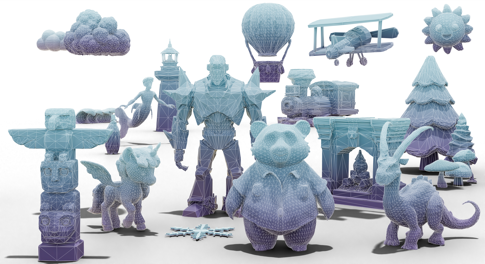

<h1 class="title is-1 publication-title">MeshRipple: Structured Autoregressive Generation of Artist-Meshes</h1>
<h4 align="center" style="line-height:1.4; margin-top:0.6rem">
  <a href="https://openreview.net/profile?id=~Junkai_Lin1">Junkai Lin</a><sup>1</sup>,
  <a href="https://openreview.net/profile?id=~Hang_Long1">Hang Long</a><sup>1</sup>,
  <a href="https://openreview.net/profile?id=~Huipeng_Guo2">Huipeng Guo</a><sup>1</sup>,
  <a href="https://openreview.net/profile?id=~Jielei_Zhang2">Jielei Zhang</a><sup>1</sup>,
  <a href="https://openreview.net/profile?id=~JiaYi_Yang9">JiaYi Yang</a><sup>1</sup>,
  <a href="https://openreview.net/profile?id=~Tianle_Guo1">Tianle Guo</a><sup>1</sup>,
  <a href="https://openreview.net/profile?id=~Yang_Yang135">Yang Yang</a><sup>1</sup>,
  <a href="./index.html">Jianwen Li</a><sup>2</sup>,
  <a href="./index.html">Wenxiao Zhang</a><sup>2</sup>,
  <a href="https://niessnerlab.org">Matthias Nießner</a><sup>3</sup>,
  <a href="https://weiyang-hust.github.io">Wei Yang</a><sup>1, †</sup>
</h4>

<p align="center" style="margin:0.2rem 0 0.6rem 0;">
  <sup>1</sup> Huazhong University of Science and Technology &nbsp;&nbsp;|&nbsp;&nbsp;
  <sup>2</sup> Independent Researcher &nbsp;&nbsp;|&nbsp;&nbsp;
  <sup>3</sup> Technical University of Munich
</p>

<p align="center" style="font-size:0.95em; color:#666; margin-top:0;">
  &nbsp;&nbsp; † Corresponding author
</p>

<p align="center">
  <a href="https://maymhappy.github.io/MeshRipple/">
    
  </a>
  <a href="https://arxiv.org/abs/2512.07514">
      
  </a>
</p>


<h1 align="center" style="line-height:1.3; margin-bottom:0.6rem;">
  <!-- MeshRipple 标题图片 -->
  
</h1>

<!-- <p align="center">
    
</p> -->
</h4>

## Abstract

Meshes serve as a primary representation for 3D assets. Autoregressive mesh generators serialize faces into sequences and train on truncated segments with sliding-window inference to cope with memory limits. However, this mismatch breaks long-range geometric dependencies, producing holes and fragmented components. 
To address this critical limitation, we introduce <b>MeshRipple</b>, which expands a mesh outward from an active generation frontier, akin to a ripple on a surface.
MeshRipple rests on three key innovations: a frontier-aware BFS tokenization that aligns the generation order with surface topology; an expansive prediction strategy that maintains coherent, connected surface growth; and a sparse-attention global memory that provides an effectively unbounded receptive field to resolve long-range topological dependencies.
This integrated design enables MeshRipple to generate meshes with high surface fidelity and topological completeness, outperforming strong recent baselines.
## TODO
- [ ] Release inference & training code of Hourglass tarnsformers
- [ ] Release inference code for MeshRipple
- [ ] Release training code for MeshRipple


## Citation
If you find our work helpful, please consider citing:
```bibtex
@misc{lin2025meshripplestructuredautoregressivegeneration,
      title={MeshRipple: Structured Autoregressive Generation of Artist-Meshes}, 
      author={Junkai Lin and Hang Long and Huipeng Guo and Jielei Zhang and JiaYi Yang and Tianle Guo and Yang Yang and Jianwen Li and Wenxiao Zhang and Matthias Nießner and Wei Yang},
      year={2025},
      eprint={2512.07514},
      archivePrefix={arXiv},
      primaryClass={cs.CV},
      url={https://arxiv.org/abs/2512.07514}, 
}
```